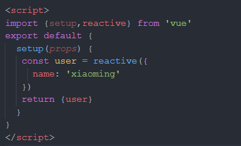

# Vue3快速上手

> 对于已经学习过Vue2的用户，希望了解Vue3新功能和更改的用户。

## 概览

- 2013年，在 Google 工作的尤雨溪，受到 Angular 的启发，开发出了一款轻量框架，最初命名为 Seed 。
- 2013.12，更名为 Vue，图标颜色是代表勃勃生机的绿色，版本号是 0.6.0。
- 2014.01.24，Vue 正式对外发布，版本号是 0.8.0。
- 2014.02.25，0.9.0 发布，有了自己的代号：Animatrix，此后，重要的版本都会有自己的代号。
- 2015.06.13，0.12.0，代号Dragon Ball，Laravel 社区（一款流行的 PHP 框架的社区）首次使用 Vue，Vue 在 JS 社区也打响了知名度。
- 2015.10.26，1.0.0 Evangelion 是 Vue 历史上的第一个里程碑。同年，vue-router、vuex、vue-cli 相继发布，标志着 Vue从一个视图层库发展为一个渐进式框架。
- 2016.10.01，2.0.0 是第二个重要的里程碑，它吸收了 React 的虚拟 Dom 方案，还支持服务端渲染。自从Vue 2.0 发布之后，Vue 就成了前端领域的热门话题。
- 2019.02.05，Vue 发布了 2.6.0 ，这是一个承前启后的版本，在它之后，将推出 3.0.0。
- 2019.12.05，在万众期待中，尤雨溪公布了 Vue 3 源代码，目前 Vue 3 的进展情况可以通过这个链接查看：[https://github.com/vuejs/vue/projects/6 ](https://github.com/vuejs/vue/projects/6)。
- 2020.09.18,  Vue3.0.0正式发布，代号One Piece，3.0.0最大的变化包含，使用TS重写了vue的源码，引入了composition API，性能显著提升等等。
- 2021.08.05, 3.2.0 代号Quintessential Quintuplets ，<script setup>正式毕业，新增<style>里面书写v-bind等等
- 2021.09.08，3.2.11最新版本

## 快速上手

想要快速尝试Vue 3:

* 通过CDN

* 通过脚手架vue-cli

  ```bash
  npm install -g @vue/cli # 或 yarn global add @vue/cli
  vue create hello-vue3
  # 选择 vue 3 preset
  ```

* 通过最新脚手架Vite

  ```shell
  npm init vite hello-vue3 -- --template vue # 或 yarn create vite hello-vue3 --template vue	
  ```

> 老项目迁移，可以参考官方文档。

## composition API（组合式API）

通过创建 Vue 组件，我们可以将界面中重复的部分连同其功能一起提取为可重用的代码段。仅此一项就可以使我们的应用在可维护性和灵活性方面走得相当远。然而，我们的经验已经证明，光靠这一点可能并不够，尤其是当你的应用变得非常大的时候——想想几百个组件。处理这样的大型应用时，共享和重用代码变得尤为重要。

* option API VS composition API


### DOM挂载方式

DOM节点挂载的方式从vue2.0中 new Vue() 实例的方式变成了Vue3.0中 createApp() 的方法


### setup

- composition api其实是配合着 options选项一起使用的，因为还有name、props、components、setup这些选项。只不过是以前所有的功能都成为了一个一个的hook函数，在使用时需要手动引入，并且需要写在setup选项里面。而setup的存在就是为了让我们能够使用composition api。
- setup在组件实例创建之前便开始执行，因此在setup选项中没有this。这也意味着，除了props，你将无法访问到组件任何的状态或者方法。以前data里面的数据我们是直接可以绑定到template上面的，而在vue3.0 Composition API中需要在setup里面return出去，那么数据便会被合并到渲染的上下文中去，从而在template中使用。

* setup参数
  setup(props,context)/setup(props,{attrs,slots,emit})

| **参数** | **含义**                                                     |
| -------- | ------------------------------------------------------------ |
| props    | 包含props配置声明且传入了的所有属性的对象（props对象是响应式的，不要去解构，解构会失去响式性） |
| attrs    | 包含没有在props配置中声明的属性的对象，相当于this.$attrs     |
| slots    | 包含所有传入的插槽内容的对象，相当于this.$slots              |
| emit     | 用来分发自定义事件的函数，相当于this.$emit                   |

### reactive

reactive接收一个普通对象然后返回该普通对象的响应式代理



- 普通对象==>返回一个proxy对象，响应式转换是深层的，对影响对象内部所有嵌套的属性
- 用user.name=“new name”来修改值
- 内部基于proxy实现
- 获取数据值的时候直接获取，不需要加.value
- 参数只能传入对象类型

### ref

ref 接受一个内部值并返回一个响应式可变的ref对象


- 任意类型==>返回一个ref对象
- 用num.value=***来修改值
- 获取数据值的时候需要加.value。可以理解为ref是通过reactive包装了一层具有value属性的对象实现的
- 参数可以传递任意数据类型，传递对象类型时也能保持深度响应式，所以适用性更广，setup中定义数据时推荐优先使用ref，方便逻辑拆分和业务解耦
- template中使用ref值不用通过value获取（导出后已默认做了一个解构），js中使用ref必须通过.value获取
- ref获取元素

### toRef

toRef 用于为源响应式对象上的属性新建一个ref，从而保持对其源对象属性的响应式连接。接收两个参数：源响应式对象和属性名，返回一个ref数据。例如使用父组件传递的props数据时，要引用props的某个属性且要保持响应式连接时就很有用。